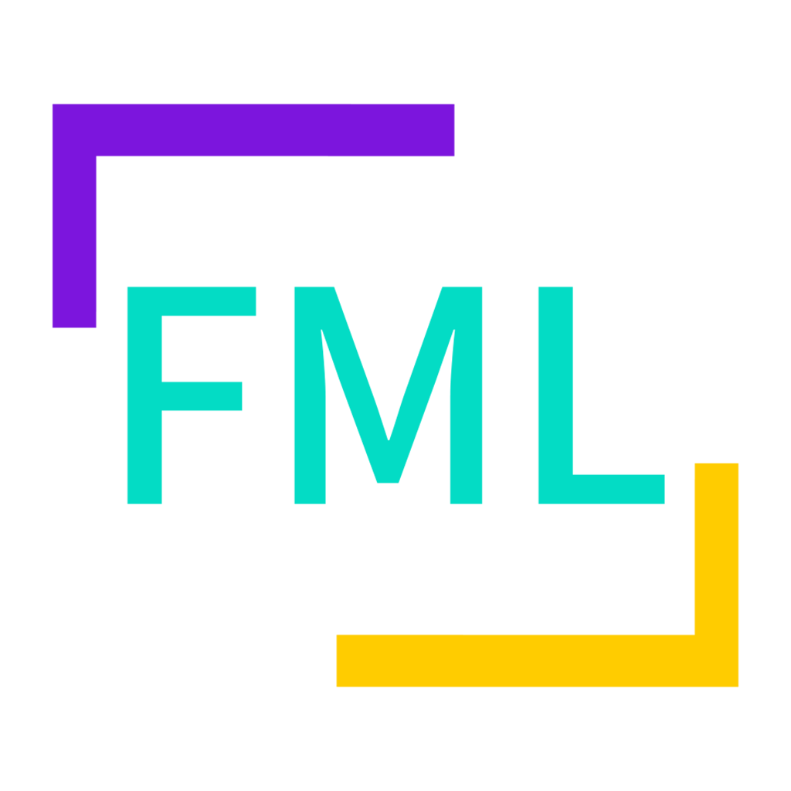

# Flutter Minecraft Launcher

一个由Flutter编写的Material Design 3风格的使用GPL3.0协议开源跨平台Vanilla/Fabric/NeoForge Minecraft Java启动器,支持Windows、macOS、Linux

# shared_preferences
软件配置
| 键 | 值 | 类型 |
| -- | -- |-- |
| version | 软件版本 | string |
| build | 软件构建号 | int |
| themeColor | 自定义主题颜色 | int |
| themeMode | 是否跟随深色 | string |
| SelectedAccount | 选择的账号 | string |
| SelectedPath | 选择的文件夹 | string |
| SelectedGame | 选择的版本 | string |
| AccountsList | 账号列表 | list(string) |
| PathList | 游戏文件夹列表 | list(string) |
| Path_$name | 版本路径 | lstring |
| Game_$name | 版本列表 | list(string) |

账号配置 Account_$name list(string)
| 序号 | 值 |
| -- | -- |
| 0 | 生成UUID |
| 1 | 是否启用在线账号(1启用,0禁用) |
| 2 | 是否启用自定义UUID(1启用,0禁用) |
| 3 | 自定义UUID |

版本配置 Config_${name}_$game list(string)
| 序号 | 值 |
| -- | -- |
| 0 | 游戏类型(Vanilla、Fabric、NeoForge) |
| 1 | xmx |
| 2 | 是否启用全屏(1启用,0禁用) |
| 3 | 游戏宽度 |
| 4 | 游戏高度 |
| 5 | server |
| 6 | port |

###### flutter logo : [Sawaratsuki](https://github.com/SAWARATSUKI)